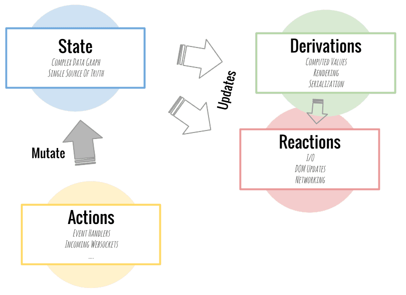
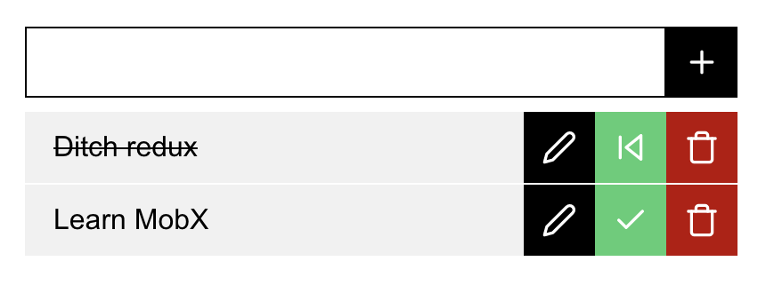
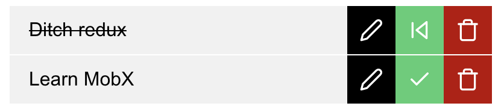

# Mobx store wit React and TypeScript

Do you remember the pain, the headache when you first tried to learn Redux?

I know, I have been there.

The first time I used MobX, I was amazed, how easy it is to use and how good the React integration was.

## What is Mobx

According to the official documentation, MobX is a battle-tested library that makes state management simple and scalable by transparently applying functional reactive programming (TFRP). The philosophy behind MobX is simple:

### Straightforward

Write minimalistic, boilerplate free code that captures your intent. Trying to update a record field? Use the good old JavaScript assignment. Updating data in an asynchronous process? No special tools are required, the reactivity system will detect all your changes and propagate them out to where they are being used.

### Effortless optimal rendering

All changes to and uses of your data are tracked at runtime, building a dependency tree that captures all relations between state and output. This guarantees that computations depending on your state, like React components, run only when strictly needed.

### Architectural freedom

MobX is unopinionated and allows you to manage your application state outside of any UI framework. This makes your code decoupled, portable, and above all, easily testable.

MobX tracks property access, not values.



sources:

- https://mobx.js.org/README.html
- https://doc.ebichu.cc/mobx/best/react.html

## Let's build a todo app

Let's build a todo app, and learn how to use Mobx with React!

If you follow the guide you will end up with this simple todo app



Let initialize our application:

```bash
yarn create react-app mobx-todo --template typescript
```

Add the packages we will use:

```bash
yarn add mobx mobx-react react-feather node-sass
```

Rename `App.css` to `App.scss` and replace its content to:

```scss
* {
  box-sizing: border-box !important;
  font-family: Arial, Helvetica, sans-serif;
}

html,
body,
#root {
  height: 100%;
  width: 100%;
  margin: 0;
  padding: 0;
}

#root {
  overflow-y: auto;
  display: flex;
  flex-direction: column;
  align-items: center;
}

.todo {
  margin-top: 48px;
  & {
    max-width: 400px;
    width: 100%;
  }

  & button {
    display: block;
    width: 40px;
    height: 40px;
    background: #000;
    outline: none;
    border: none;
    color: #fff;
    border-radius: 0;
    display: flex;
    align-items: center;
    justify-content: center;
    cursor: pointer;

    &.red {
      background: #bb0000;
    }

    &.green {
      background: #47cf73;
    }
  }

  &-form {
    display: flex;
    margin-bottom: 8px;
    &-input {
      height: 40px;
      line-height: 40px;
      font-size: 20px;
      padding: 0 16px;
      margin: 0;
      display: block;
      border: 1px solid #000;
      border-radius: 0;
      flex-grow: 1;
    }
  }

  &-list {
    list-style: none;
    margin: 0;
    padding: 0;
    &-item {
      display: flex;
      margin-bottom: 1px;
      background: #f1f1f1;
      & > span {
        flex-grow: 1;
        line-height: 40px;
        padding: 0 16px;
      }

      &.done > span {
        text-decoration: line-through;
      }
    }
  }

  &-no-items {
    text-align: center;
  }
}
```

With decorators, it will be much easier to work with Mobx so let's enable the decorators in our tsconfig:

```
"experimentalDecorators": true
```

Lets create a types.d.ts and model our todo item:

```typescript
export interface ITodoItem {
  id: number;
  content: string;
  done: boolean;
}
```

So now we are able to create our store:

```typescript
import { action, computed, observable, makeObservable } from "mobx";
import { ITodoItem } from "./types";
import React from "react";

export class TodoStore {
  constructor() {
    makeObservable(this);
  }

  @observable public todoItems: ITodoItem[] = [
    {
      id: 1,
      content: "Ditch redux",
      done: true,
    },
    {
      id: 2,
      content: "Learn MobX",
      done: false,
    },
  ];

  @action public  setTodoItems = (v: ITodoItem[]) => {
    this.todoItems = v;
  }
}
```

As you can see a mobx store is simply just a `class` with properties and methods. Mobx properties are mutable.

If you are using decorators please use the `makeObserver(this)` inside the stores constructor.

You can even use abstraction to have a base class for multiple stores...

If you want to use a property in React, you need to decorate it with the `@observable` decorator. All the observables are mutable. If strict mode the observables are mutable only inside actions. If you take a risk of worse debugging processs, you can disable the strict mode and use setters to mutate the observables outside the store.

For now we simply created `todoItems` with default values and a getter and setter for our todo store

## Make it possible to use Mobx with React

```typescript
const rootStore = { todoStore: new TodoStore() };

const TodoStoreContext = React.createContext(rootStore);

export const useStores = () => React.useContext(TodoStoreContext);
```

We will use Reacts context to access the store for our application we won't use a provider and we will directly access our context through a custom hook, but if you prefer using providers, feel free to change the code.

We create a root store, a root store can hold multiple stores. By default, the stores can not communicate between themselves.

For example you can achieve multi store communication with a ootstore like this:

```typescript
class AuthStore {
  protected readonly rootStore: RootStore;
  constructor(rootStore: RootStore) {
    this.rootStore = rootStore;
  }
  // ...
}

class RootStore {
  public authStore = new AuthStore(this);
  public todoStore = new TodoStore(this);
}

const TodoStoreContext = React.createContext(new RootStore());
```

So every store can access the instance of the root store and through that, we can access other stores. Don't forget to add a property and change the constructor in every store where you need to share context.

In our todo app, we won't use a multi-store setup.

## Rendering data from Mobx

We will create 2 modules to render out our list.

- TodoItemList
- TodoItem

**TodoItemList**:

The `TodoItemList` renders a text a message if the source todos array is empty otherwise it renders a list of todo items.

```typescript
import React from "react";

import { observer } from "mobx-react";

import { useStores } from "./TodoStore";


export const TodoItemList: React.FC = observer(() => {
  const { todoStore } = useStores();

  if (!todoStore.todoItems.length) {
    return <span>Please add some todos</span>;
  }

  return (
    <ul className="todo-list">
      {todoStore.sortedTodoItems.map((item) => (
        <TodoItem key={item.id} item={item} />
      ))}
    </ul>
  );
});
```

Inside the `TodoItem` we access our store through the `useStores` hook we created and we render everything as usual. Without the use `observer` HoC the component would render just fine on mounting but it would not rerender on source data change.

Now we will go back to our TodoStore and add the new getter `sortedTodoItems`.

```typescript
...

export class TodoStore {
  ...

  @computed public get sortedTodoItems(): ITodoItem[] {
    return this.todoItems.slice().sort((a, b) => a.id - b.id);
  }
}
```

The `@computed` decorator enables us to access data from one or multiple observable properties, the computed values are recalculated if one of the observables used inside the computed property changes.

We are using the `sortedTodoItems` getter, which is a `computed` property, to render our items, this getter returns the `todoItems` observable property ordered by the todo items ids. Computed properties are recalculated when any of the tracked observable inside their definition changes.

If you write anything that should track the changes of the source data use it inside the `observer` HoC.

**TodoItem**:

The `TodoItem` component renders our todo item and uses its actions. Accessing the store and rendering the data is based on the same principles as in the `TodoItemList` component.

```typescript
import React from "react";

import { Trash, Check, Edit2, SkipBack } from "react-feather";
import { observer } from "mobx-react";
import { reaction } from "mobx";

import { useStores } from "./TodoStore";
import { ITodoItem } from "./types";

interface TodoItemProps {
  item: ITodoItem;
}

export const TodoItem: React.FC<TodoItemProps> = observer(({ item }) => {
  const className = "todo-list-item" + (item.done ? " done" : "");

  return (
    <li className={className}>
      <span>{item.content}</span>
      <button>
        <Edit2 size="20" color="#fff" />
      </button>
      <button className="green">
        {item.done ? (
          <SkipBack size="20" color="#fff" />
        ) : (
          <Check size="20" color="#fff" />
        )}
      </button>
      <button className="red">
        <Trash size="20" color="#fff" />
      </button>
    </li>
  );
});
```


We are passing an `item` property to the `TodoItem` component, but this is not just a simple object, it's an observable object. Our component would not rerender without the `observer` HoC on the change of the `item`.

If we would like to ditch the `observer` in the `TodoItem` component, we would need to pass down primitives through the props, in our case we could pass down each property of the `item` object or a clone of our observable with the help of the `toJS` function provided by Mobx which will recursively convert an (observable) object to a javascript structure. All the observables are proxies, and they are not representing our data directly.

Our app currently should look like this:


## Modify and Remove a TodoItem

We can define three functions:

- onCheckClick (toggles the todo state [done=true|false])
- onTrashClick (removes the item from the store)
- onEditClick (sets the item as editing source)

After defining the functions our component will look like this:

```typescript
export const TodoItem: React.FC<TodoItemProps> = observer(({ item }) => {
  const { todoStore } = useStores();

  const onCheckClick = () => {
    todoStore.toggleState(item);
  };

  const onTrashClick = () => {
    todoStore.removeItem(item);
  };

  const className = "todo-list-item" + (item.done ? " done" : "");

  return (
    <li className={className}>
      <span>{item.content}</span>
      <button>
        <Edit2 size="20" color="#fff" />
      </button>
      <button className="green" onClick={onCheckClick}>
        {item.done ? (
          <SkipBack size="20" color="#fff" />
        ) : (
          <Check size="20" color="#fff" />
        )}
      </button>
      <button className="red" onClick={onTrashClick}>
        <Trash size="20" color="#fff" />
      </button>
    </li>
  );
});
```

In `onCheckClick` and `onTrashClick`, we are using actions defined in our store like this.

```typescript
...

export class TodoStore {
  ...

  @action toggleState = (item: ITodoItem) => {
    item.done = !item.done;
  };

  @action public removeItem(item: ITodoItem) {
    const indexToRemove = this.todoItems.findIndex(
      (todo) => todo.id === item.id
    );

    this.todoItems.splice(indexToRemove, 1);
  }
}
```

Every callable action should be decorated with the `@action` decorator. The `@action` decorator enables us to change data in the store. Using this decorator is not necessary, but helpful in the debugging process.

All the observables are mutable, you can see it in our store methods changing object properties, arrays... When you change an observable please do it always in an `@action`;

Using getters and setters is not a must, you can make your observables public, and use only actions to change data, but it is a nice feature you can use.

We could even rewrite our actions to `closures` so they could be used directly in the component.

Example:

```typescript
// In store
// ...
@action toggleState = (item: ITodoItem) => () => {
  item.done = !item.done;
};
// ...
// In component
// ...
<button className="green" onClick={projectstore.toggleState(item)}>
// ...
```

Never pass store methods through props to child components, the calling, the call would not have the right context and the method would not be available to access any observable.

## Add a new item to the store and enable editing

For adding a new item to our store we will create a new component.

```typescript
export const TodoForm = () => {
  const { todoStore } = useStores();

  const input = React.useRef<HTMLInputElement | null>(null);

  const handleSubmit = (event: React.FormEvent<HTMLFormElement>) => {
    event.preventDefault();

    if (input.current && input.current.value) {
      todoStore.addItem(input.current.value);
      input.current.value = "";
    }
  };

  return (
    <form className="todo-form" onSubmit={handleSubmit}>
      <input
        ref={input}
        type="text"
        name="todo-content"
        className="todo-form-input"
      />
      <button type="submit">
        <Plus size="20" color="#fff" />
      </button>
    </form>
  );
};
```

After that we update our `TodoStore`

```typescript
...

export class TodoStore {
  ...

  @action addItem(todoContent: string) {
    this.todoItems.push({
      id: Date.now(),
      content: todoContent,
      done: false,
    });
  }
}
```

The result of this component looks like this:


Basically, it is just a simple form, which on submitting calls the `addItem` action of our store. The `addItem` action adds a new todo to our array.

To add edit functionality first we need to update our `TodoItem` component with a new function `onEditClick`

```typescript
export const TodoItem: React.FC<TodoItemProps> = observer(({ item }) => {
  ...

  const onEditClick = () => {
    todoStore.setEditItem(item);
  };

  const className = "todo-list-item" + (item.done ? " done" : "");

  return (
    <li className={className}>
      <span>{item.content}</span>
      <button onClick={onEditClick} disabled={item.done}>
        <Edit2 size="20" color="#fff" />
      </button>
      <button className="green" onClick={onCheckClick}>
        {item.done ? (
          <SkipBack size="20" color="#fff" />
        ) : (
          <Check size="20" color="#fff" />
        )}
      </button>
      <button className="red" onClick={onTrashClick}>
        <Trash size="20" color="#fff" />
      </button>
    </li>
  );
});
```

After that we will update our `TodoStore`

```typescript
...

export class TodoStore {
  ...

  @observable public itemToEdit?: ITodoItem;

  @action public setItemToEdit = (v: ITodoItem | undefined)  => {
    this.itemToEdit = v;
  }

  @action addItem(todoContent: string) {
     if (this.itemToEdit) {
      this.itemToEdit.content = todoContent;
      this.itemToEdit = undefined;
      return;
    }

    this.todoItems.push({
      id: Date.now(),
      content: todoContent,
      done: false,
    });
  }
}
```

And finally we add reaction to our `TodoForm` component.

```typescript
export const TodoForm = () => {
  ...

  React.useEffect(() => {
    reaction(
      () => todoStore.itemToEdit,
      () => {
        if (input.current && todoStore.itemToEdit) {
          input.current.value = todoStore.itemToEdit.content;
        }
      }
    );
  }, []);

  ...
};
```

When we click to edit on a todo item we set the `itemToEdit` observable, we cant use observables in a `useEffect` hook. To run side effects we have to use reactions.

We have three different reactions in Mobx:

- `autorun` (runs every time any observable is changed in the store)
- `when` (runs when a condition is fulfilled)
- `reaction` (runs when tracked observable/observables change)

You can define reactions in a store or the components. If you define reactions in components always use them inside a `useEffect` hook with an empty dependency list.

We are using a `when` reaction where we check if the `itemToEdit` observable is defined (through the `itemToEdit` getter). When the condition result is true we replace the input value with the value of the item content.
## Persisting data

Last but not least, to have a fully working todo app we need to persisnt data. Luckilly this is exeptionally easy with MobX Persist Store.

First we need to install the library

```
  yarn add mobx-persist-store
```

After the installation inside our TodoStore constructor we need to add only one function `makePersistable`:

```typescript
...
import { makePersistable } from "mobx-persist-store";

export class TodoStore {
  constructor() {
    makeObservable(this);

    makePersistable(this, {
      name: "TodoStore",
      properties: ["todoItems"],
      storage: localStorage
    });
  }

...
}
```

First argument of `makePersistable` is reference to the store. Second argument is `StorageOptions` object where name is the `name` of the store you want to persist and `properties` is an array with observables you want to persist. Last argument is the storage itself which may be localStorage, sessionStorage, localForage, ect. If you would like to develop an mobile app using React Native you may use AsyncStorage instead of localStorage

After that we should have a fully working todo application!
## Thank you all

source code available at: https://github.com/TheOnlyBeardedBeast/mobx-react-ts-todo
try it out at: https://theonlybeardedbeast.github.io/mobx-react-ts-todo/
